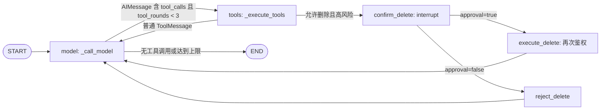
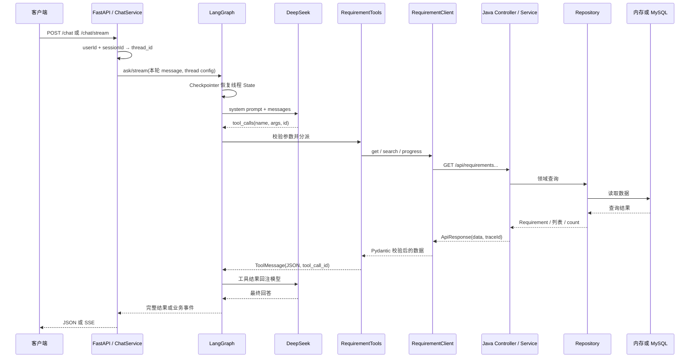
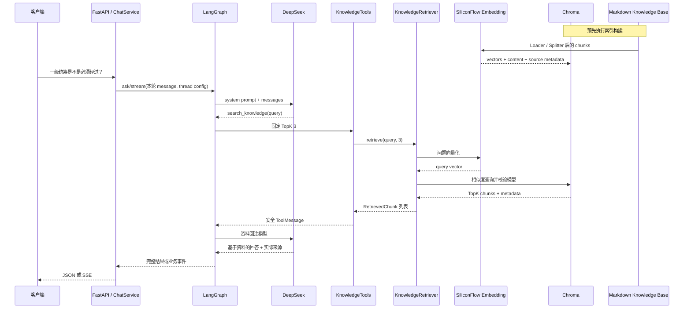

# 当前 Java 后端、Python Agent 与 RAG 调用链

本文记录当前已经实现的只读需求查询、知识问答与高风险删除确认 Demo，不描述后续计划中的能力。

## 模块职责

| 模块 | 职责 | 边界 |
| --- | --- | --- |
| `agent/` | 提供 `/chat` 与 `/chat/resume` SSE，以 SQLite Checkpointer 持久化线程 State，编排 LangGraph，调用 DeepSeek、Java API 和知识索引 | 不直连业务数据库；仅用内存 Map 演示删除 |
| `backend/` | 提供需求详情、组合检索和进度查询 API，按 Controller → Service → Repository 分层 | 只读；通过 Profile 切换内存与 MySQL Repository |
| `knowledge/` | 保存用于构建索引的 UTF-8 Markdown 业务说明 | 运行时不会自动重建索引 |
| `docs/` | 保存接口契约、当前调用链和开发阶段记录 | 不承载运行时代码 |

## 统一入口与会话

1. 客户端向 `POST /chat` 提交模拟 `user`、可选 `threadId` 和 `message`，接口返回 SSE；`POST /chat/stream` 是兼容别名。
2. `ChatService` 将 user id、username 和 roles 初始化进 Graph State。生产环境同一位置应改为读取经过验证的 SSO/JWT claims。
3. 新协议直接使用或生成 `thread_id`；兼容输入 `(userId, sessionId)` 仍会哈希为稳定线程标识。
4. 新聊天提交本轮 `HumanMessage`、`user_context` 并重置 Tool 轮次；Graph 从 Checkpointer 自动恢复既有 State。`POST /chat/resume` 使用相同 `thread_id` 和 `Command(resume=approval)` 恢复。
5. FastAPI lifespan 创建并初始化同一个 `AsyncSqliteSaver`，Agent 用它编译 Graph，关闭服务时释放 SQLite 连接。默认数据库为 `agent/data/checkpoints.sqlite`，可通过 `CHECKPOINT_DB_PATH` 配置；相对路径按 `agent/` 目录解析。

## LangGraph 执行流程

`RequirementAgentState` 包含 `messages`、`tool_rounds`、`user_context`、`pending_action` 和 `action_approved`：

- `messages` 使用 `add_messages` reducer 追加 Human、AI 和 Tool 消息。
- `tool_rounds` 每执行一次工具节点加一，将工具调用循环限制为最多三轮；每次新用户输入都重置为 `0`，不会跨用户轮次累计。
- `user_context` 让中断恢复后仍能找到发起用户；它保存的是身份上下文，不是可信的授权结论。
- `pending_action` 保存动作类型、目标和描述，供 checkpoint、SSE 以及恢复节点共享。

模型节点在上下文前加入系统提示词，再调用已绑定 Tool Schema 的 DeepSeek 模型。模型可以选择 `delete_prepare`，但不能直接调用 `delete_execute`；执行 Tool 只允许由确认分支触发。

工具节点按名称分派调用，将结构化结果与原始 tool call id 封装为 `ToolMessage`。删除预检查允许后，Graph 进入真实 `interrupt`，而不是等待一条普通聊天消息。

## 当前 Tool

| Tool | 实现 | 用途 | 数据来源 |
| --- | --- | --- | --- |
| `get_requirement_by_no` | `RequirementTools.get_requirement_by_no` | 查询需求详情 | Java API |
| `search_requirements` | `RequirementTools.search_requirements` | 组合条件分页查询 | Java API |
| `get_requirement_progress` | `RequirementTools.get_requirement_progress` | 查询需求进度 | Java API |
| `search_knowledge` | `KnowledgeTools.search_knowledge` | 查询需求规则和操作说明，固定 TopK 3 | Chroma 知识索引 |
| `delete_prepare` | `DeleteTools.delete_prepare` | 删除前检查单据、归属和风险 | 内存 Map |
| `delete_execute` | `DeleteTools.delete_execute` | 人工确认后删除，并再次鉴权 | 内存 Map |

三个 Requirement Tool 先使用 Pydantic 校验参数，再通过异步 `RequirementClient` 请求 Java。`search_knowledge` 只接收完整问题文本，不允许模型控制 TopK。模型不能直接访问 MySQL。

## 高风险删除 HITL 调用链

1. 模型识别“删除单据 DOC001”，只调用 `delete_prepare(document_id)`；Graph 从 State 注入 `user_context`。
2. Tool 读取内存 `documents` 并校验 owner 或 `admin` 角色。无权时返回结构化 `NO_PERMISSION`；允许时返回 `risk=HIGH` 和 `need_confirmation=true`。
3. 工具节点写入 `pending_action`，确认节点调用 `interrupt`。Checkpointer 保存同一 `thread_id` 的消息、身份和待处理动作。
4. SSE 返回 `HUMAN_ACTION_REQUIRED`，只表达 `CONFIRM_DELETE` 业务动作，不包含 `show_dialog` 等 UI 指令。
5. 客户端调用 `/chat/resume`。同意后 Graph 调用 `delete_execute`；Tool 重新读取单据并重新鉴权，不信任 prepare 的权限结论。拒绝时不调用执行 Tool。

## 结构化需求查询调用链

1. 模型根据问题选择详情、组合检索或进度 Tool，并生成符合 JSON Schema 的参数。
2. `RequirementTools` 使用 `RequirementNoInput` 或 `SearchRequirementsInput` 校验参数。
3. `RequirementClient` 通过异步 `httpx.AsyncClient` 调用 Java：
   - `GET /api/requirements/{requirementNo}`
   - `GET /api/requirements`
   - `GET /api/requirements/{requirementNo}/progress`
4. Java `RequirementController` 校验路径或查询参数，调用 `RequirementService`。
5. `RequirementService` 依赖 `RequirementRepository` 抽象。默认 local Profile 使用 `InMemoryRequirementRepository`；mysql Profile 使用 `MyBatisRequirementRepository` → `RequirementMapper` → MySQL。
6. Java 使用统一 `ApiResponse` 返回数据、错误码和 traceId；Python Client 使用 Pydantic 校验信封与具体数据结构。
7. Tool 将安全的结构化结果写入 `ToolMessage`，模型据此生成最终中文回答。

## RAG 知识问答调用链

### 索引构建

1. `MarkdownDocumentLoader` 从 `knowledge/` 递归加载非空 UTF-8 Markdown，并保存相对来源路径。
2. `MarkdownTextSplitter` 按 Markdown 标题、自然段和中文句末切分，默认目标长度约 700 字符，重叠约 100 字符。
3. `SiliconFlowEmbeddingProvider` 使用默认模型 `BAAI/bge-m3` 批量生成 chunk 向量。
4. `KnowledgeIndexer` 通过 `ChromaVectorStore.rebuild` 删除同名 collection 并完整重建，避免重复 chunk 与已删除文档残留。
5. Chroma `PersistentClient` 持久化向量、正文、来源元数据和构建时使用的 Embedding 模型。

### 在线检索与回答

1. 模型识别流程规则或操作说明问题，选择 `search_knowledge`。
2. `KnowledgeTools` 用 Pydantic 校验 `query`，固定调用 `KnowledgeRetriever.retrieve(query, top_k=3)`。
3. `KnowledgeRetriever` 使用 SiliconFlow 将问题向量化，再调用 `ChromaVectorStore.search`。
4. VectorStore 校验 collection 存在、内容非空，并确认索引模型与当前查询模型一致，然后返回 TopK chunk。
5. Tool 只向模型返回 `rank`、`document_title`、安全文件名 `source`、`chunk_index` 和 `content`；不返回向量、distance、chunk ID 或绝对路径。
6. Tool 结果经 `ToolMessage` 回注模型。系统提示词要求回答只依据召回资料，列出实际使用的来源；无足够资料时明确拒答。

## SSE 事件与 Checkpoint 时机

`RequirementAgent.stream` 消费 LangGraph 的 `messages + updates` 流式模式：`messages` 仅用于提取模型最终文本，`updates` 用于生成安全的工具状态。FastAPI 不直接处理 LangGraph 原始事件，也不保存 token chunk 或重新维护历史。

| 事件 | 来源与语义 |
| --- | --- |
| `status` | Agent 接受请求后的处理状态 |
| `tool` | 模型节点与工具节点产生的概括状态，不含参数和原始结果 |
| `message` | 模型最终回答的文本增量，不含 reasoning 或 tool-call chunk |
| `error` | SSE 已开始后发生的安全、结构化错误 |
| `done` | Graph 原生流正常结束 |
| `HUMAN_ACTION_REQUIRED` | interrupt 已持久化，等待客户端以同一 thread_id 恢复 |

Checkpointer 在每个完成的 Graph super-step 后保存 State；模型节点完成后会保存 AI tool call，工具节点以带相同 call id 的 `ToolMessage` 完成配对。意外 Tool 异常会转为明确的失败 ToolMessage，避免留下无法配对的消息。模型异常或客户端取消不会破坏之前已完成的 checkpoint；最多保留本轮已经完成节点的状态，不会把 SSE 裸 token chunk 写入 `messages`。SSE 响应开始后无法修改 HTTP 状态码，异常统一转为 `error` 事件。

## 核心类和方法

| 位置 | 类 / 方法 | 作用 |
| --- | --- | --- |
| `agent/app/main.py` | `create_app` | 创建 FastAPI，在 lifespan 启停 ChatService 及 Checkpointer |
| `agent/app/api/chat.py` | `stream_chat` / `resume_chat` | 发起、恢复与业务 SSE 编码 |
| `agent/app/agent/service.py` | `stream_chat` / `resume_chat` / `_get_agent` | 注入用户上下文并连接 Agent、Java Client 和 RAG |
| `agent/app/agent/thread_id.py` | `build_thread_id` | 集中生成稳定、固定长度的线程标识 |
| `agent/app/agent/state.py` | `RequirementAgentState` | 定义消息、用户上下文和待确认动作 |
| `agent/app/agent/graph.py` | `stream` / `resume` / `_confirm_delete` / `_execute_delete` | LangGraph 发起、interrupt、恢复与执行分支 |
| `agent/app/agent/tool_schemas.py` | `requirement_tool_schemas` | 定义模型可选择的查询与删除预检查 Schema |
| `agent/app/tools/delete_tools.py` | `DeleteTools` | 结构化预检查、执行阶段重复鉴权和内存删除 |
| `agent/app/tools/requirement_tools.py` | `RequirementTools` | 校验需求 Tool 参数并安全映射 Java Client 结果 |
| `agent/app/clients/requirement_client.py` | `RequirementClient._get` | 异步调用 Java 并校验统一响应 |
| `agent/app/tools/knowledge_tools.py` | `KnowledgeTools.search_knowledge` | 固定 TopK 3，映射知识检索结果与错误 |
| `agent/app/rag/retriever.py` | `KnowledgeRetriever.retrieve` | 协调查询向量化与 Chroma 检索 |
| `agent/app/rag/embedding.py` | `SiliconFlowEmbeddingProvider` | 调用 SiliconFlow Embedding API |
| `agent/app/rag/vector_store.py` | `ChromaVectorStore.rebuild` / `search` | 完整重建、持久化、模型校验与 TopK 查询 |
| `agent/app/rag/document_loader.py` | `MarkdownDocumentLoader.load` | 递归加载 Markdown 并保留来源 |
| `agent/app/rag/text_splitter.py` | `MarkdownTextSplitter.split_documents` | 按文档结构切分知识块 |
| `backend/.../RequirementController.java` | `getByRequirementNo` / `search` / `getProgress` | 三个 Java REST 入口 |
| `backend/.../RequirementService.java` | `getByRequirementNo` / `search` / `getProgress` | 查询校验及领域/API DTO 映射 |
| `backend/.../RequirementRepository.java` | `findByRequirementNo` / `findAll` / `count` | Service 唯一依赖的仓储抽象 |
| `backend/.../GlobalExceptionHandler.java` | 异常处理方法 | 统一输出带 traceId 的 `ApiResponse` |

## 异常与安全映射

| 位置 | 情况 | 当前处理 |
| --- | --- | --- |
| FastAPI / 模型 | 未设置 `DEEPSEEK_API_KEY` | SSE 返回 `AGENT_UNAVAILABLE` error；`/health` 不受影响 |
| Knowledge Tool | 未设置 `SILICONFLOW_API_KEY` | 返回 `EMBEDDING_NOT_CONFIGURED`，需求 Tool 不受影响 |
| Knowledge Tool | 索引不存在或为空 | 返回 `KNOWLEDGE_INDEX_NOT_READY` |
| Knowledge Tool | 索引与查询模型不一致 | 返回 `EMBEDDING_MODEL_MISMATCH`，提示重新构建索引 |
| Embedding | 请求失败或响应非法 | 转为安全的 `EMBEDDING_REQUEST_FAILED` |
| Tool 入参 | 不符合 Pydantic 模型 | 返回 `ERROR/INVALID_ARGUMENT` 并交给模型说明 |
| HTTP Client | 连接失败、超时 | 返回 `BACKEND_UNAVAILABLE`，不暴露 URL 或连接详情 |
| HTTP Client | 非 JSON 或响应结构不匹配 | 返回 `BACKEND_PROTOCOL_ERROR` |
| Java | 需求不存在 | 404 `REQUIREMENT_NOT_FOUND`，Tool 映射为 `NO_RESULT` |
| Java | 参数非法或未预期异常 | 统一返回带 traceId 的 400 或 500 响应 |

## 当前限制

- 除内存 Map 的单据删除 HITL Demo 外，不支持真实业务写操作、合同或订单查询。
- SQLite Checkpointer 支持单实例服务重启恢复；SQLite 不用于多实例共享或生产级高并发。
- 当前没有真实认证；请求中的 user 只模拟 SSO/JWT。删除 Tool 只实现 owner/admin 的演示权限。
- RAG 仅做 TopK 向量召回，不包含 Rerank、相似度阈值或 Hybrid Search。
- 系统提示词暂不支持同一轮组合结构化业务数据 Tool 与知识库 Tool。
- FastAPI 请求 traceId 尚未完整透传至 Java；Java 会自行读取或生成 traceId。
- 默认 local Profile 使用内存样例数据；只有激活 mysql Profile 时才使用 MyBatis-Plus、Flyway 和 MySQL。
